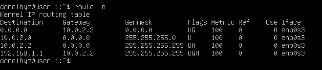
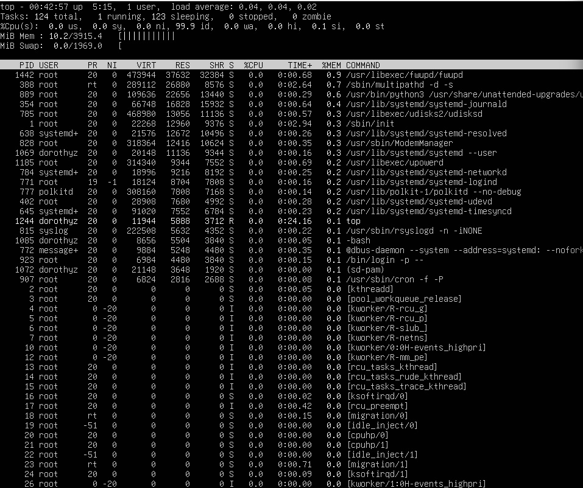
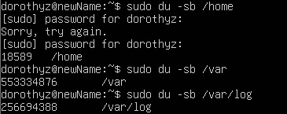
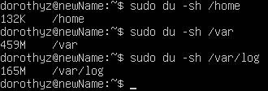

# Отчет по проекту D01_Linux
## Ник: dorothyz

## Contents
1. [Part 1](#part-1)
2. [Part 2](#part-2)
3. [Part 3](#part-3)
4. [Part 4](#part-4)
5. [Part 5](#part-5)
6. [Part 6](#part-6)
7. [Part 7](#part-7)
8. [Part 8](#part-8)
9. [Part 9](#part-9)
10. [Part 10](#part-10)
11. [Part 11](#part-11)
12. [Part 12](#part-12)
13. [Part 13](#part-13)
14. [Part 14](#part-14)
15. [Part 15](#part-15)

## Part 1
Установил **Ubuntu 20.04 Server LTS** через **VirtualBox** 

проверил версию установленной системы

## Part 2
создал нового пользователя от имени суперпользователя

проверил его наличие, он находится в самом низу

## Part 3
#### Cмена имени машины:
узнаем текущее имя

меняем имя в **ВИМ**е

Чтобы все сервисы начали использовать новое имя, вводим следующую команду

перезагружаем VirtualBox? получаем новое имя машины

меняем часовой пояса

проверяем сетевые интерфейсы:

Один из самых основных виртуальных интерфейсов - lo. Это локальный интерфейс, который позволяет программам обращаться к этому компьютеру. Используя консольную команду получить ip адрес устройства, на котором вы работаете, от DHCP сервера.

DHCP - это клиент-серверный протокол динамической конфигурации хоста (Dynamic Host Configuration Protocol), с помощью которого в ИТ-инфраструктуре сетевые параметры каждого нового устройства прописываются автоматически.

Определить и вывести на экран внешний ip-адрес шлюза (ip) и внутренний IP-адрес шлюза, он же ip-адрес по умолчанию (gw):

Зададим статичные (заданные вручную, а не полученные от DHCP сервера) настройки ip, gw, dns (использовать публичный DNS серверы, например 1.1.1.1 или 8.8.8.8).

проверим изменения и пропингуем адреса

## Part 4
обновим систему

## Part 5

выдаем права доступа для пользовыателя созданного в Part 2

сменим hostname от имени нового пользователя

## Part 6

Настроить службу автоматической синхронизации времени.

## Part 7

Установка текстовых редакторов    

создадим файл test_vim.txt, выход ESC + :wq

создадим файл test_nano.txt, выход CTRL + O + X 

создадим файл test_mcedit.txt, выход F2 + F10 

изменим файл test_vim.txt, чтобы выйти без сохранения ESC + : q!

изменим файл test_nano.txt, чтобы выйти без сохранения CTRL + X + N

изменим файл test_mcedit.txt, чтобы выйти без сохранения  F10  + No

выполним поиск по файлам

vim:
поиск

замена 

nano: поиск ^W

замена  ^\\

mcedit: поиск F7

замена F4

## Part 8

не получилось, решаем проблему

проблема решилась

Используя команду ps, показать наличие процесса sshd. Для этого к команде нужно подобрать ключи.

-tan:

t-по протоколу TCP

a-Отображение всех подключений и ожидающих портов.

n- Отображение адресов и номеров портов в числовом формате.

Cтолбцы:

Recv-Q -количество запросов в очередях на приём на данном узле/компьютере

Send-Q -количество запросов в очередях на отправку на данном узле/компьютере

Local Address - адрес и номер локального конца сокета

Foreign Address - адрес и номер порта удаленного порта сокета

State - состояние сокета

Если в качестве адреса отображается 0.0.0.0 , то это означает - "любой адрес", т. е в соединении могут использоваться все IP-адреса существующие на данном компьютере.

ps -aux | grep sshd output:

ps-выводит список текущих процессов на вашем сервере в виде таблицы

a-выбрать все процессы, кроме фоновых;

u-выбрать процессы пользователя.

x-заставляет ps перечислить все процессы, принадлежащие вам

## Part 9

### Top

uptime

кол-во пользователей

загрузка системы

кол-во процессов

загрузка CPU

Загрузка памяти

сортировка процессов по количеству занимаемой памяти

сортировка процесов процессорному времени

### Htop

Pid

CPU

MEM

TIME

sshd

hostname, time, uptime

## Part 10

запустить утилиту fdisk -l

имяБ размер 10 Gb

количество секторов 20971520

## Part 11

### df
для корневого раздела

размер раздела 1028772

размер занятого пространства 4515276

размер свободного пространства 5162824

процент использованной памяти 47%

df -Th для корневого раздела 

размер раздела 9.8

используется 4.4 

доступно 5.0

прцент использованной памяти 47%

Tип файловой системы для раздела-ext4

## Part 12
Вывести размер папок /home, /var, /var/log (в байтах)

Вывести размер всего содержимого в /var/log (не общее, а каждого вложенного элемента, используя *)

## Part 13
установим утилиту ncdu
проверим /home /var /var/log

## Part 14
dmesg

syslog

auth

время последней успешной авторизации- 2024-06-25 02:41:14

имя пользователя-user-1

метод входа в систему-sudo

Перезапустить службу SSHd.

## Part 15
запишем команду в расписание crontab

проверим ее работу по syslog

удалим все записи и проверим их наличие
